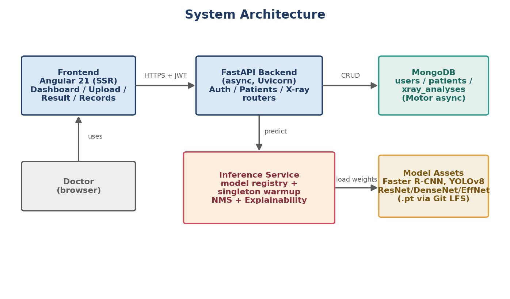
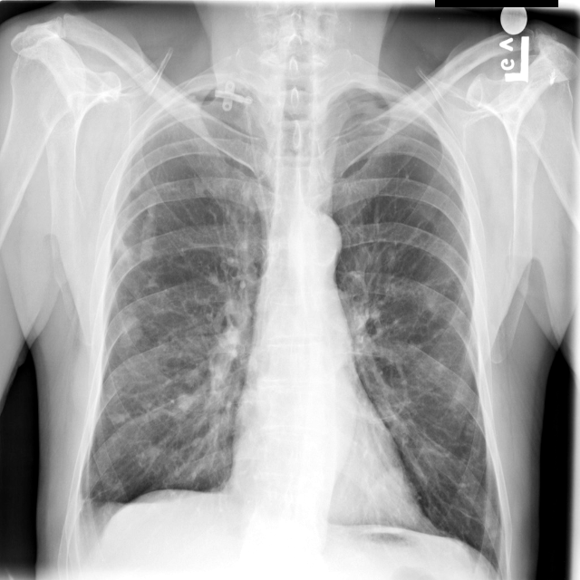

<p align="center">
  
</p>

<h1 align="center">Chest X-ray Pneumonia Detection System</h1>

<p align="center">
  An AI-assisted web platform for pneumonia screening and localization from chest radiographs.<br/>
  <i>Graduation Project - School of Computational Sciences and Artificial Intelligence (CSAI), Zewail City of Science and Technology - June 2026</i>
</p>

---

## Project Description

The Chest X-ray Pneumonia Detection System is a complete, doctor-facing web application that uses deep learning to support pneumonia screening from chest X-ray images. A physician signs in, creates patient records, uploads a chest X-ray, and receives an automated reading: whether pneumonia is likely present, a bounding box showing where, a confidence score, and an explainability heatmap. Every analysis is stored per patient for later review. The system serves five trained models (two detectors and three classifiers) through a single model registry, with Faster R-CNN deployed as the default detector.

## Team Members

| Name | ID | Program | Role |
|---|---|---|---|
| Moamen Elsayed Elsharkawy | 202202015 | CSAI | AI Researcher |
| Habiba Ayman Amin | 202202088 | CSAI | AI Researcher |
| Ahmed Gamal Abdelfattah | 202201638 | CSAI | Full-stack |
| Sara Mostafa Ali | 202201305 | CSAI | Full-stack |

**Supervisor:** Prof. Dr. Khaled Mostafa  
**Team Number:** 19

## Problem Statement

Pneumonia is a leading cause of illness and death worldwide, and the chest X-ray is the first-line tool used to detect it. In many clinics the number of radiographs far exceeds the number of radiologists available to read them, which delays diagnosis and increases the chance of missed cases. This project provides a practical, accessible system that screens chest radiographs automatically, highlights suspicious regions, quantifies its confidence, and keeps a reviewable record per patient, while keeping the physician in control of the final diagnosis.

## Features

- Secure doctor accounts with JWT authentication and bcrypt-hashed passwords.
- Patient record management (create, view, update, delete) isolated per doctor.
- Chest X-ray upload with drag-and-drop and live preview.
- Automated inference: pneumonia decision, bounding box localization, and confidence score.
- Visual explainability (Grad-CAM and related heatmaps) rendered with every prediction.
- Multiple models behind one registry (Faster R-CNN, YOLOv8, ResNet50, DenseNet121, EfficientNet-B0).
- Persistent analysis history per patient.
- Auto-generated OpenAPI (Swagger) documentation and a health endpoint.

## System Architecture

The system follows a modular three-tier architecture: an Angular single-page frontend (with server-side rendering), an asynchronous FastAPI backend, and a MongoDB database, with a PyTorch inference service that loads model weights from a registry.

<p align="center">
  
</p>

## Technologies Used

| Layer | Technology |
|---|---|
| Frontend | Angular 21 (TypeScript), Server-Side Rendering (Express) |
| Backend | FastAPI (Python), Uvicorn, async I/O |
| Database | MongoDB (Motor async driver) |
| AI / ML | PyTorch, torchvision, Ultralytics (YOLOv8) |
| Auth & Security | JWT (python-jose), bcrypt (passlib), CORS |
| Model storage | Git LFS for the `.pt` checkpoints |

## Setup Instructions

> Requirements: Python 3.12, Node.js 20+ and npm, a running MongoDB instance (local or MongoDB Atlas), and Git LFS.

**1. Clone (with Git LFS so the model weights download):**
```bash
git lfs install
git clone https://github.com/202201638/Graduation_project_Fully_team_2026.git
cd Graduation_project_Fully_team_2026
```

**2. Backend:**
```bash
cd Backend
python -m venv venv
# Windows:  .\venv\Scripts\activate    |  Linux/Mac:  source venv/bin/activate
pip install -r requirements.txt
copy .env.example .env          # then edit .env: set SECRET_KEY and MONGODB_URL
python main.py                  # dev server, or:  uvicorn main:app --host 0.0.0.0 --port 8000
```

**3. Frontend (in a second terminal):**
```bash
cd Frontend
npm install
npm start                       # dev server at http://localhost:4200
# production build:  npm run build
```

## Deployment Instructions

1. Provision a MongoDB instance and set `MONGODB_URL` in `Backend/.env`.
2. Set `APP_ENV=production`, a strong 32+ character `SECRET_KEY`, and the deployed frontend URL in `CORS_ORIGINS`.
3. Serve the backend with `uvicorn main:app --host 0.0.0.0 --port 8000` behind a reverse proxy.
4. Build the frontend with `npm run build` and serve `Frontend/dist/medical_system` (static + SSR).
5. Ensure the model weights in `Backend/model_assets/*.pt` are present (pulled via Git LFS).

## Usage Guide

1. Register a doctor account and log in.
2. Create or select a patient record.
3. Open the upload page and choose a chest X-ray image (a preview is shown).
4. Submit for analysis and wait on the processing screen.
5. Review the result: the annotated image, the pneumonia decision, the confidence score, and the heatmap.
6. Find the saved analysis later in the patient history.

## API Summary

| Endpoint | Method | Purpose |
|---|---|---|
| `/api/auth/signup`, `/login`, `/me` | POST/GET | Authentication and current user |
| `/api/patients` | CRUD | Patient record management |
| `/api/xray/upload` | POST | Upload, run inference, persist result |
| `/api/xray`, `/api/xray/{id}` | GET/DELETE | List and manage analyses |
| `/api/xray/status`, `/metadata` | GET | Model status and metadata |
| `/health`, `/docs` | GET | Health check and Swagger documentation |

## Results (held-out test set, RSNA Pneumonia Detection Challenge)

- **Best classifier:** EfficientNet-B0, AUC 0.886.
- **Deployed detector:** Faster R-CNN, recall 0.812, mAP@0.5 0.381 (recall prioritized to minimize missed pneumonia).
- Leak-free, patient-wise split (20% held-out test: 4,135 normal / 1,202 pneumonia).

## Screenshots / Demo

Sample detector output and evaluation figures are in [`documentation/figures/`](documentation/figures/). The full thesis, in-depth explanation, defense presentation, and poster are in [`documentation/`](documentation/).

<p align="center">
  
</p>

## Repository Structure

```
Backend/        FastAPI backend, inference service, model_assets (Git LFS)
Frontend/       Angular 21 single-page application (SSR)
ai/             Research pipeline: data prep, training, optimization, evaluation
documentation/  Thesis, explanation, presentation, poster, figures
```

## License

See [LICENSE](LICENSE).
